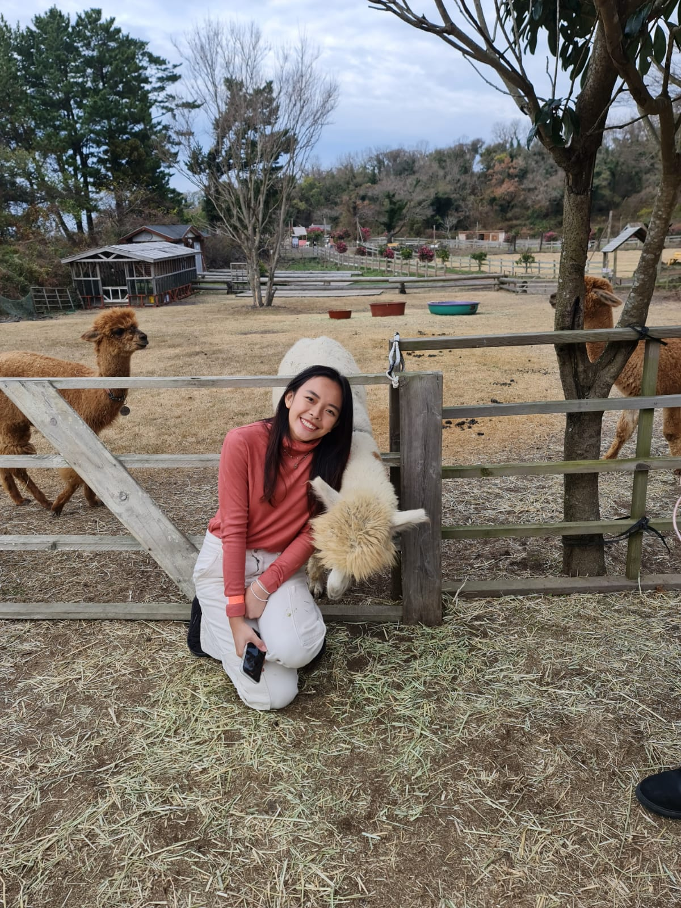

# Introduction
Hello, I am Annette, a Year 3 Econonomics student studying at NUS! I am very excited to learn new skills with R in this mod, and I hope that with consistent effort and practice I will perform decently for this mod!
This file took a while to be correct but its all good now my frist takeaway from this mod would be that ''' needs to be on a separate line!

```{r, out.height= "450px",out.width= "500px",echo=TRUE,eval=TRUE,fig.cap="Me in korea!"}
 
```

```{r, out.height= "350px",out.width= "800px",echo=TRUE,eval=TRUE,fig.cap="Rstudio layout"}
knitr::include_graphics("/Users/annettelokexinghui/Dropbox/Mac/Documents/NM2207/Week-1/Screenshot 2023-08-14 at 7.44.43 PM.png") 
```
